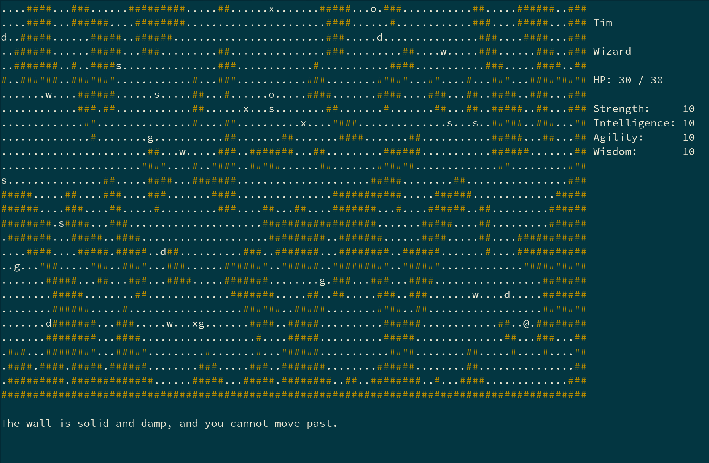

# go-roguelike - straightforward roguelike written in golang

go-roguelike is a plain ol' roguelike game implemented in golang. It
resembles other roguelikes, such as nethack.



This project uses the ncurses library via Cgo wrapper, but the majority of
the of the code is in golang.

Perhaps one day it will be completed, but for now it is still missing
key features like inventory or proper monster generation or multiple
levels.


## Requirements

Ideally this requires a terminal that is compatible with newer C
libraries. Most computers should work quite well.

Specifically, the following packages are required:

* golang
* ncurses

Nothing else should be needed, but in my experience some exotic (i.e.
non-x86) platforms tend to have gimpy or partly functional ncurses
libraries, so it ought to go without saying that certain bugs may be
present. 

I tend to write software on the x86-64 and arm7 architectures, so feel
free to shoot me an email if you discover bugs on other platforms.


## Running go-roguelike

Enter the following command to build the executable:

```
make
```

Simply run the compiled file from the commandline and it should work as
intended.

```
./go_roguelike
```

## Additional Notes

Certain newer versions of ncurses tend to enforce a stricter definition
of exactly what a terminal is, and what behaviour to try to emulate.

Mostly this applies to Linux distros like Arch that default
to `xterm` or `term-256color` for the TERM environment variable, whether
or not the terminal is able to behave in that manner.

In the case of the xfce4-terminal or gnome-terminal, consider setting the
following to achieve best results:

`export TERM=gnome-256color`

Users of konsole terminal can try the following:

`export TERM=konsole-256color`

In the case of other terminals, consider consulting the man page of your
terminal for further information.

## Authors

This project was created by Robert Bisewski at Ibis Cybernetics. For more
information, contact:

https://www.ibiscybernetics.com

Or send an email to:

```
rbisewski@ibiscybernetics.com
```
